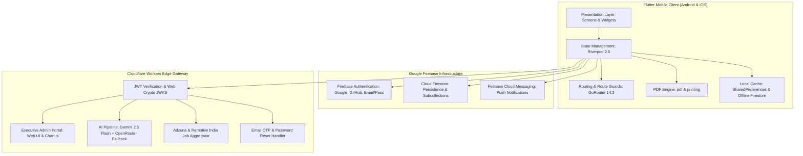
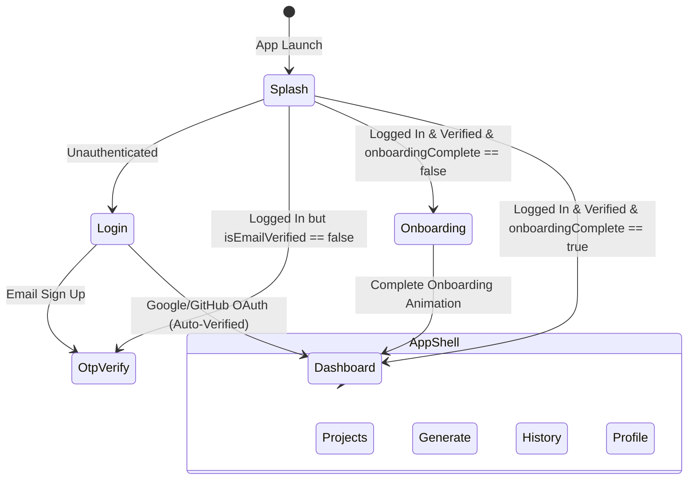
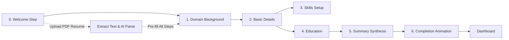
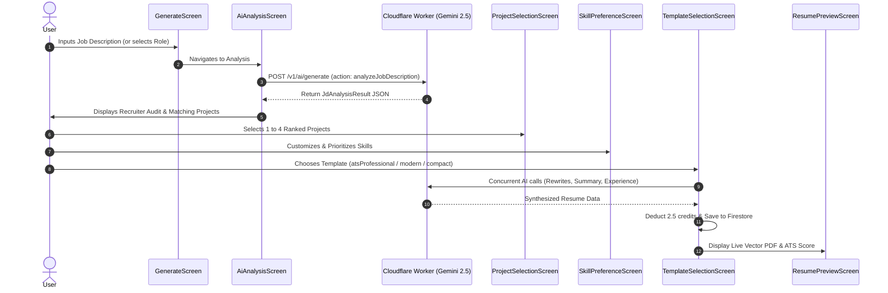

# ResumeOS (AI Career Operating System) — Complete Technical & Functional Documentation

---

## 1. Executive Summary & Application Overview

**ResumeOS** (registered internally as `ai_career_os`) is an advanced, production-grade AI-powered Career Operating System and Intelligent Resume Builder mobile application built using Flutter and backed by a serverless Cloudflare Workers edge gateway and Google Firebase.

### Core Value Proposition
Traditional resume builders rely on rigid templates that candidates manually populate with generic text. In contrast, ResumeOS acts as a complete career intelligence suite:
1. **Targeted ATS Optimization**: Analyzes real-world job descriptions (or industry roles) to extract exact Applicant Tracking System (ATS) keywords, required technical competencies, domain terminology, and organizational challenges.
2. **Context-Aware Semantic Matching**: Cross-references the extracted job requirements with the candidate's verified career history, scoring and ranking portfolio projects and research work against the role.
3. **Automated Professional Content Generation**: Utilizes multi-stage Large Language Model (LLM) pipelines (Google Gemini 2.5 Flash with OpenRouter fallback) to rewrite project bullets, synthesize career summaries, and refine work experiences into high-impact, authentic accomplishments adhering to the strict **Action + Context + Tech Stack + Measurable Metric** formula without hallucinating false metrics.
4. **ATS-Compliant Document Compilation**: Renders high-fidelity, single- or multi-page PDF resumes using three distinct layout paradigms (`atsProfessional`, `modernMinimal`, and `compactClean`) with real-time typography and theme customizations.
5. **Career Continuity & Job Discovery**: Integrates live IT job opening feeds with city-tiering algorithms, GitHub repository synchronization with built-in rate-limiting, an internal points/credit economy, and an executive administration console.

---

## 2. High-Level Architecture & Tech Stack



### 2.1 Technology Stack Details

| Layer / Component | Technology / Library | Version / Detail | Purpose |
| :--- | :--- | :--- | :--- |
| **Framework** | Flutter / Dart SDK | SDK `>=3.0.0 <4.0.0` | Cross-platform mobile development (Android & iOS) |
| **State Management** | `flutter_riverpod`, `riverpod_annotation` | `^2.5.1` / `^2.3.5` | Reactive dependency injection, reactive streams, family providers |
| **Navigation** | `go_router` | `^14.3.0` | Declarative routing, nested shell routes, deep linking, auth guards |
| **Authentication** | `firebase_auth`, `google_sign_in` | `^5.3.1`, `^6.2.1` | Google OAuth, GitHub OAuth, and Email/Password credentials |
| **Database & Cache** | `cloud_firestore` | `^5.4.3` | Real-time NoSQL cloud database with offline cache enabled |
| **Push Notifications** | `firebase_messaging` | `^15.1.3` | FCM push notifications, foreground stream alerts, topic broadcast |
| **PDF Generation** | `pdf`, `printing` | `^3.11.1`, `^5.13.1` | Native vector PDF rendering, printing, and OS sharing sheet |
| **PDF Text Extraction**| `syncfusion_flutter_pdf` | `^33.2.13` | Extracting raw text from existing PDF resumes during onboarding |
| **Typography & UI** | `google_fonts`, `flutter_svg`, `shimmer`, `percent_indicator` | Modern Google Fonts | `Outfit`, `JetBrains Mono`, and `Inter` typefaces; dark aurora theme |
| **Edge Serverless** | Cloudflare Workers (JavaScript Web Crypto) | Node / Fetch Web Standards | Secure AI API gateway, Adzuna proxy, OTP handlers, Admin Portal |
| **AI LLM Engines** | Google Gemini 2.5 Flash & OpenRouter | Dual-Provider Gateway | Role extraction, ATS optimization, bullet rewriting, professional summary |
| **External Job APIs** | Adzuna API & Remotive API | REST API v1 | Real-time Indian and global tech jobs aggregation |
| **Third-Party Time** | `timeapi.io` & `worldtimeapi.org` | REST API | Tamper-proof UTC time validation for Sunday weekly points claim |

---

## 3. Database Schema & Data Models

ResumeOS organizes data in Cloud Firestore under user-scoped collections and hierarchical subcollections.

### 3.1 Top-Level Documents: `/users/{uid}`

The primary `UserModel` document contains all user identity, progress, points, and preferences:

```dart
class UserModel {
  final String uid;                   // Firebase Authentication UID
  final String name;                  // Full Display Name
  final String email;                 // User Email Address
  final String phone;                 // Contact Number
  final String location;              // Current City/State/Country
  final String githubUrl;             // GitHub Profile Link
  final String linkedinUrl;           // LinkedIn Profile Link
  final String portfolioUrl;          // Personal Portfolio / Website Link
  final String profileImageUrl;       // Avatar Photo URL
  final String summary;               // Master Career / Bio Summary
  final String currentRole;           // Professional Title (e.g. Full-Stack Engineer)
  final bool onboardingComplete;      // Flag indicating completion of onboarding
  final ResumePreferences resumePreferences; // Default styling preferences
  final DateTime? createdAt;          // Account creation timestamp
  final bool isEmailVerified;         // Custom OTP verification flag
  final String domainBackground;      // Selected Career Domain (Tech, Business, etc.)
  final String gender;                // Gender field
  final double points;                // Balance of AI generation credits (default: 10.0)
  final List<String> claimedMilestones;// IDs of claimed profile milestones
  final String lastClaimedSunday;     // Date string of last claimed Sunday reward (YYYY-MM-DD)
  final String fcmToken;              // Active device FCM token for push notifications
  final int totalResumesCreated;      // Lifetime counter of resumes created
  final DateTime? lastActiveAt;       // Timestamp of user's last activity
}
```

#### ResumePreferences (Embedded Map)
* `defaultTemplate`: `'atsProfessional'`, `'modernMinimal'`, or `'compactClean'`
* `font`: Default font family name (`'Inter'`, `'sans'`, `'serif'`, `'mono'`)
* `showSummary`: Boolean toggle for professional summary visibility
* `showProjects`: Boolean toggle for projects section
* `showCertifications`: Boolean toggle for certifications section
* `showAchievements`: Boolean toggle for achievements section
* `maxProjects`: Max projects allowed per resume (default: 3)
* `maxPages`: Page constraint targets (default: 1)

---

### 3.2 User Subcollections

#### 1. `/users/{uid}/skills/{skillId}`
* `name` *(String)*: Name of the skill (e.g., `"Python"`, `"Docker"`, `"Communication"`).
* `category` *(String)*: One of `'Languages'`, `'Tools/Platforms'`, `'DevOps & Cloud'`, or `'Soft Skills'`.
* `createdAt` *(Timestamp)*: Creation timestamp.

#### 2. `/users/{uid}/education/{educationId}`
* `institution` *(String)*: University or college name.
* `degree` *(String)*: Degree earned (e.g., `"Bachelor of Science"`, `"B.Tech"`).
* `field` *(String)*: Field of study (e.g., `"Computer Science"`).
* `cgpa` *(String)*: Grade / GPA / Percentage (e.g., `"8.9/10"`).
* `duration` *(String)*: Timeframe (e.g., `"2020 - 2024"`).
* `createdAt` *(Timestamp)*: Creation timestamp.

#### 3. `/users/{uid}/experience/{experienceId}`
* `company` *(String)*: Employer / Organization name.
* `role` *(String)*: Job title held.
* `duration` *(String)*: Human-readable duration (e.g., `"Jan 2023 - Present"`).
* `startMonth` *(String)*, `startYear` *(String)*: Start date parts.
* `endMonth` *(String)*, `endYear` *(String)*: End date parts.
* `isCurrent` *(bool)*: Boolean flag for ongoing employment.
* `bullets` *(List<String>)*: Raw responsibility and achievement bullets.
* `certificateLink` *(String)*: Verification URL or credential link.
* `createdAt` *(Timestamp)*: Creation timestamp.

#### 4. `/users/{uid}/projects/{projectId}`
* `title` *(String)*: Project or research title.
* `description` *(String)*: Raw description of what was built or discovered.
* `githubRepo` *(String)*: GitHub repository URL.
* `liveUrl` *(String)*: Hosted application or demo URL.
* `technologies` *(List<String>)*: List of tools, libraries, and languages used.
* `tags` *(List<String>)*: Project tags for filtering.
* `bulletPoints` *(List<String>)*: Pre-existing bullet points.
* `aiSummary` *(String)*: Cached AI-condensed summary.
* `isGithubSynced` *(bool)*: Boolean indicating sync from GitHub API.
* `isFeatured` *(bool)*: Highlight flag for key projects.
* `linkedSkills` *(List<String>)*: Explicitly linked skills from the user's master skill list.
* `isResearch` *(bool)*: Differentiates academic/scientific research from standard development.
* `duration` *(String)*: Project duration or publication timeline.
* `contributors` *(List<Map>)*: Contributor list with `name` and specific `contribution`.
* `createdAt`, `updatedAt` *(Timestamp)*.

#### 5. `/users/{uid}/certifications/{certId}`
* `title` *(String)*: Name of the certificate or license.
* `issuer` *(String)*: Issuing entity (e.g., `"AWS"`, `"Google Cloud"`, `"Coursera"`).
* `date` *(String)*: Issue date.
* `credentialUrl` *(String)*: Verification URL.
* `createdAt` *(Timestamp)*.

#### 6. `/users/{uid}/achievements/{achId}`
* `title` *(String)*: Milestone or award title (e.g., `"1st Place Hackathon"`).
* `description` *(String)*: Summary of the achievement.
* `date` *(String)*: Date achieved.
* `createdAt` *(Timestamp)*.

#### 7. `/users/{uid}/points_history/{transactionId}`
* `title` *(String)*: Transaction headline (e.g., `"AI Resume Generation"`, `"Sunday Bonus"`, `"Admin Bonus"`).
* `description` *(String)*: Detailed explanation of point delta.
* `points` *(double)*: Numerical delta (positive for credit, negative for debit).
* `type` *(String)*: `'credit'` or `'debit'`.
* `createdAt` *(Timestamp)*: Timestamp of transaction.

#### 8. `/users/{uid}/resumes/{resumeId}`
* `jobDescription` *(String)*: Raw input job description.
* `jobRole` *(String)*: Extracted or selected target title.
* `companyName` *(String)*: Target company name.
* `detectedKeywords` *(List<String>)*: ATS keywords detected in the JD.
* `requiredSkills` *(List<String>)*: Skills identified as mandatory.
* `matchedProjectIds` *(List<String>)*: Projects selected for this version.
* `matchPercentage` *(int)*: Overall ATS alignment score (0 - 100).
* `atsScore` *(int)*: Calibrated ATS metric.
* `missingKeywords` *(List<String>)*: High-priority JD keywords missing from candidate profile.
* `templateUsed` *(String)*: `'atsProfessional'`, `'modernMinimal'`, or `'compactClean'`.
* `status` *(String)*: `'generating'`, `'complete'`, or `'error'`.
* `pdfUrl` *(String)*: Storage or cached PDF URL.
* `createdAt` *(Timestamp)*: Creation timestamp.
* `generatedResumeData` *(Map)*: Complete snapshot of compiled resume data:
  - Personal info (`name`, `email`, `phone`, `location`, `githubUrl`, `linkedinUrl`, `portfolioUrl`)
  - AI-crafted `summary`
  - Grouped `skillGroups` (`category` and `skills`)
  - `education` entries
  - Refined `experience` entries
  - Rewritten `projects` and `research` entries
  - `showResearch`, `showCertifications`, `showAchievements` toggles
  - `certifications` and `achievements` lists
  - Custom styling snapshot: `primaryColorHex`, `fontFamily`, `fontSizeScale`.

#### 9. Global Collection: `/issues/{issueId}`
* `userId` *(String)*: Submitting user ID.
* `userEmail` *(String)*: User's contact email.
* `title` *(String)*: Issue topic.
* `description` *(String)*: Technical description of problem encountered.
* `createdAt` *(Timestamp)*: Submission timestamp.

---

## 4. Routing & State Management Architecture

Navigation is governed declaratively by `GoRouter` in [app_router.dart](file:///c:/Users/Krish/.gemini/antigravity-ide/scratch/ai_career_os/lib/routes/app_router.dart).



### 4.1 Route Transition Pipeline & Guards
A custom `RouterTransitionNotifier` listens to two reactive providers:
1. `authStateProvider`: Tracks Firebase Authentication state.
2. `userProfileProvider`: Streams the active Firestore `UserModel`.

When either changes, `GoRouter.redirect` applies the following rules:
* **Unauthenticated Access**: Directs users attempting to visit secured routes back to `/login`.
* **OTP Verification Guard**: If an authenticated user has `isEmailVerified == false`, any navigation outside `/otp-verify` is forced back to `/otp-verify`.
* **Onboarding Guard**: If `isEmailVerified == true` but `onboardingComplete == false`, any attempt to navigate to the shell is redirected to `/onboarding`.
* **Verified & Onboarded**: Directs the user to the core shell at `/dashboard`.

### 4.2 Route Inventory

| Path | Screen Class | Transition Type | Description |
| :--- | :--- | :--- | :--- |
| `/` | `SplashScreen` | Default | Initial boot, token validation, brand splash animation |
| `/login` | `LoginScreen` | Fade (`220ms`) | Google, GitHub, and Email authentication |
| `/otp-verify` | `OtpVerificationScreen` | Fade (`220ms`) | 6-digit email OTP verification |
| `/account-deleted` | `AccountDeletedScreen` | Fade (`220ms`) | Account wiped confirmation screen |
| `/forgot-password` | `ForgotPasswordScreen` | Fade (`220ms`) | Forgot password OTP request and reset form |
| `/terms` | `TermsScreen` | Fade (`220ms`) | Terms of Service disclosure |
| `/privacy` | `PrivacyPolicyScreen` | Fade (`220ms`) | Privacy Policy disclosure |
| `/onboarding` | `OnboardingWrapper` | Slide (`280ms`) | 7-step onboarding wizard with resume upload |
| `/job-openings` | `JobOpeningsScreen` | Slide (`280ms`) | Full-screen paginated job openings directory |
| **Shell: Bottom Nav** | `AppShell` | No Transition | Persistent glassmorphic bottom navigation shell |
| `/dashboard` | `DashboardScreen` | No Transition | Primary home hub, greeting, jobs feed, resume guide |
| `/projects` | `ProjectsScreen` | No Transition | Projects & research manager, GitHub sync |
| `/projects/add` | `AddEditProjectScreen` | Slide Up (`320ms`) | Add new project form |
| `/projects/edit/:projectId` | `AddEditProjectScreen` | Slide Up (`320ms`) | Edit existing project form |
| `/projects/github-view/:id` | `GitHubRepoViewScreen` | Slide (`280ms`) | In-app GitHub repository details viewer |
| `/projects/add-research` | `AddEditResearchScreen` | Slide Up (`320ms`) | Add academic/industrial research work |
| `/projects/edit-research/:id` | `AddEditResearchScreen` | Slide Up (`320ms`) | Edit research work |
| `/generate` | `GenerateScreen` | No Transition | Job description input & trending roles selector |
| `/generate/analyze` | `AiAnalysisScreen` | Slide (`280ms`) | Recruiter audit, ATS keyword analysis |
| `/generate/predefined-roles` | `PredefinedRolesScreen` | Slide (`280ms`) | Curated role library across 5 sectors |
| `/generate/select-projects` | `ProjectSelectionScreen` | Slide (`280ms`) | Keyword-ranked project selection |
| `/generate/select-skills` | `SkillPreferenceScreen` | Slide (`280ms`) | Categorized skills prioritizing & selection |
| `/generate/select-template` | `TemplateSelectionScreen` | Slide (`280ms`) | Template picker, generation launcher |
| `/generate/preview/:resumeId` | `ResumePreviewScreen` | Slide (`280ms`) | Live PDF viewer, styling toolbar, share |
| `/generate/edit/:resumeId` | `ResumeEditScreen` | Slide (`280ms`) | Form editor with live preview toggle |
| `/history` | `HistoryScreen` | No Transition | Resume generation history and analytics |
| `/profile` | `ProfileScreen` | No Transition | Comprehensive profile editor and tabs |
| `/profile/edit/:section` | `ProfileSectionEditScreen` | Slide (`280ms`) | Reusable section editor (Education, Exp, etc.) |
| `/profile/skills` | `ProfileSkillsEditScreen` | Slide (`280ms`) | Categorized skill management screen |
| `/profile/summary-enhance` | `ProfileSummaryAiEnhanceScreen` | Slide (`280ms`) | Cosmic bubble AI summary generation wizard |
| `/profile/settings` | `SettingsScreen` | Slide (`280ms`) | Legal, BYOK, issue reporting, sign-out |
| `/profile/context` | `ProfileContextScreen` | Slide (`280ms`) | Profile context summary & PDF export |
| `/profile/points` | `PointsScreen` | Slide (`280ms`) | Credit balance, history, Sunday reward |
| `/profile/resume-guide/:type` | `ResumeGuideScreen` | Slide (`280ms`) | Technical / Non-technical resume playbook |

---

## 5. End-to-End Feature & Functionality Breakdown

### 5.1 Authentication, Security & Account Management
1. **Google Sign-In**:
   - Authenticates via `google_sign_in` plugin, obtaining Google ID Token and Access Token.
   - Automatically provisions `/users/{uid}` profile with verified status.
2. **GitHub OAuth Sign-In**:
   - Authenticates via Firebase `GithubAuthProvider` requesting `repo` and `user:email` scopes.
   - Captures OAuth access token in `gitHubTokenProvider` to allow immediate repository synchronization without re-authenticating.
3. **Email / Password Authentication & OTP Verification**:
   - Accounts created via email default to `isEmailVerified: false`.
   - The app makes an authenticated POST request to `/v1/auth/send-otp` on the Cloudflare Workers backend.
   - A random 6-digit cryptographic verification code is stored in the user document and delivered to the user's email.
   - Upon submitting the code to `/v1/auth/verify-otp`, the backend validates the code, checks expiration, and updates `isEmailVerified: true`.
4. **Forgot Password Flow**:
   - User inputs their email address on `ForgotPasswordScreen`.
   - Cloudflare endpoint `/v1/auth/forgot-password/send-otp` dispatches a secure reset code.
   - Endpoint `/v1/auth/forgot-password/verify-and-reset` verifies the code and invokes Firebase Identity Toolkit Admin API to update the password.
5. **GDPR Account & Data Deletion**:
   - From `SettingsScreen`, users can initiate permanent account deletion.
   - Calls backend route `/v1/auth/delete-account`.
   - The backend uses Google Service Account OAuth assertions to iteratively delete all documents in every user subcollection (`skills`, `education`, `experience`, `certifications`, `achievements`, `resumes`, `projects`, `points_history`), deletes the top-level `/users/{uid}` document, and executes `batchDelete` on the Firebase Authentication record.
   - Navigates the client to `AccountDeletedScreen`.

---

### 5.2 Onboarding Wizard (`OnboardingWrapper`)
The onboarding experience guides new users through setting up their professional profile, complete with an option to bootstrap data from an existing resume.



* **Step 0: Welcome & Resume Bootstrap**:
  - Choice between *Start from Scratch* or *Upload Existing Resume PDF*.
  - When a PDF is selected via `file_picker`, `syncfusion_flutter_pdf` extracts all text content.
  - The extracted text is dispatched to the backend AI endpoint `parseResume`, which maps candidate information into structured JSON: personal details, education, work experience, skills, and certifications.
* **Step 1: Domain Background**:
  - Candidate selects their target industry domain (e.g., Software Engineering, Data Science, Product Management, Finance, Design, Marketing).
* **Step 2: Basic Contact Details**:
  - Full Name, Email, Phone, Location (City/State), Portfolio URL, LinkedIn URL, GitHub URL.
* **Step 3: Core Skills**:
  - Interactive chip selection grouped into *Languages*, *Tools/Platforms*, *DevOps & Cloud*, and *Soft Skills*, with custom skill input.
* **Step 4: Academic Landmarks**:
  - Degree, Field of Study, Institution, CGPA / Percentage, Graduation Duration.
* **Step 5: Professional Summary**:
  - Allows manual typing or 1-tap AI drafting based on previously supplied profile details.
* **Step 6: Completion Celebration**:
  - Grants initial 10 AI generation credits.
  - Features an animated radial wipe transition (`_transitionController`) that zooms out the onboarding canvas and smoothly materializes the dark theme `DashboardScreen`.

---

### 5.3 The Command Dashboard (`DashboardScreen`)
The home screen serves as the daily cockpit for career development:
1. **Dynamic Lighting & Ambient Canvas**:
   - Built on a dark indigo base (`#07060F`) with dual spotlight blooms, golden sunlight leaks, and volumetric diagonal light beams.
2. **Contextual Time-Based Greeting**:
   - Reads the local device hour to display "Good Morning", "Good Afternoon", "Good Evening", or "Good Night" along with the user's first name.
3. **Credit Status Capsule**:
   - Displays real-time points balance. Tapping routes to `PointsScreen`.
4. **Interactive Profile Completion Card**:
   - `profileCompletionProvider` dynamically calculates completion percentage (0 - 100%) by auditing contact info, bio, education, experience, skills, projects, certifications, and achievements.
   - Highlights missing items with direct shortcut navigation to complete them.
5. **Resume Builder Quick Launch**:
   - Prominent card prompting users to target a new role or job posting.
6. **Live Indian IT Jobs Stream**:
   - Embedded widget displaying fresh openings from Adzuna (with Remotive fallback).
   - Shows job title, company, location badge, and publication timestamp.
   - "Apply" opens the application URL in the browser via `url_launcher`.
   - "Tailor Resume" pre-populates the Job Description and triggers the AI generator.
7. **"Know the Resume" Interactive Playbook**:
   - Dual-tab quick access to the Technical and Non-Technical Resume Guides.

---

### 5.4 Projects & Research Work (`ProjectsScreen`)
ResumeOS treats software projects and scientific research with equal prominence, enabling deep attribution of technical work:

#### Project vs. Research Capabilities
* **Software Projects**: Title, Description, Live Demo URL, GitHub Repository Link, Tech Stack chips, Bullet Points list, AI Summary, Featured Project toggle.
* **Research Work**: Scientific/Academic Title, Abstract/Summary, Duration, Methodologies, Publication/Working Paper link, and an expandable **Contributors Matrix** capturing co-researchers' names and specific contributions (e.g. "Primary Author", "Data Processing", "Model Training").

#### Link Skills Architecture (`LinkSkillsBottomSheet`)
Users can link skills from their profile directly to projects or research items. When generating resumes, the matching algorithm computes bonus affinity points if a project explicitly demonstrates a required job skill.

#### GitHub Synchronization Engine (`GitHubService` & `GitHubSyncLimiter`)
* **OAuth & Public Username Sync**:
  - If signed in via GitHub, uses OAuth bearer tokens to retrieve all user repos (public and private).
  - Users can also fetch public repositories by GitHub username without OAuth.
  - Automatically converts repositories into project drafts, pre-filling title, description, repository URL, primary programming language, and topics.
* **Algorithmic Rate-Limiting Protection (`GitHubSyncLimiter`)**:
  - To prevent GitHub API 403 rate-limit bans, requests are tracked locally in `SharedPreferences`:
    - **Hourly Soft Warning**: Warns user when hourly syncs exceed 45.
    - **Hourly Hard Block**: At 55 syncs in 1 hour, triggers a 2-hour cooldown lock.
    - **Daily Hard Block**: At 80 syncs in 24 hours, locks synchronization for 24 hours.
  - UI displays real-time countdown timers during cooldowns.

---

### 5.5 Intelligent AI Resume Generator Pipeline
The flagship generation engine converts raw career history into an ATS-optimized, role-tailored resume in 7 steps:



#### Step 1: Input (`GenerateScreen` & `PredefinedRolesScreen`)
* Paste custom Job Description (with character/word count validation) or pick from:
  - **Trending Roles**: Software Engineer, Financial Analyst, Data Scientist, Product Manager, Marketing Specialist.
  - **Predefined Roles Library**: 30+ curated roles across Engineering & Tech, Data & Analytics, Product & Design, Finance & Business, and Marketing & Sales.

#### Step 2: Recruiter-Level AI Analysis (`AiAnalysisScreen`)
Calls Cloudflare backend action `analyzeJobDescription`. Returns structured data:
* **Target Role & Calibrated Seniority**: Junior, Mid, or Senior.
* **Required vs. Preferred Skills**: Hard technical capabilities vs. nice-to-haves.
* **Non-Negotiable Skills**: Critical fundamentals needed to pass initial screening.
* **High-Demand / Booming Skills**: Modern frameworks, cloud tools, or methodologies.
* **Company Problems to Solve**: Business value propositions the company seeks.
* **Company Cultural Traits**: Execution velocity, ownership mentality, product thinking.
* **Top ATS Keywords**: High-frequency search terminology.
* **Sample High-Impact Bullets**: Realistic accomplishment examples in Action + Metric format.
* **Recommended Standout Projects**: Ideal portfolio project architectures.
* **Resume Positioning Strategy**: A 40-50 word strategic guidance statement.
* **Algorithmic Keyword Ranking**:
  ```dart
  double scoreAgainst(List<String> keywords) {
    // Computes matching weight: Title (x3), Description (x2), Tech Stack (x2), Linked Skills (x2)
  }
  ```

#### Step 3: Project Selection (`ProjectSelectionScreen`)
* Presents projects ordered by keyword match score.
* Candidate selects 1 to 4 projects to include.

#### Step 4: Skill Customization (`SkillPreferenceScreen`)
* Auto-sorts skills into Languages, Tools/Platforms, DevOps & Cloud, and Soft Skills.
* Highlights matching skills found in the JD.
* Candidate toggles skills to emphasize or omit.

#### Step 5: AI Resume Crafting & Generation (`TemplateSelectionScreen`)
1. **Credit Verification**: Confirms candidate balance $\ge 2.5$ points.
2. **Concurrent Multi-Task AI Execution**:
   - `rewriteProjectBullets`: Generates exactly 3 ATS-optimized bullets per project following the Action + Tech + Metric formula. Strictly prohibits fabricated business scale or false metrics.
   - `generateProfessionalSummary`: Synthesizes an authentic 3-4 sentence professional summary without first-person pronouns or generic buzzwords like "versatile" or "results-driven".
   - `refineExperienceBullets`: Formulates exactly 2 bullets (if a certificate link exists) or 3 bullets per job role, incorporating target keywords.
3. **Animated Crafting Overlay (`AiResumeCraftingOverlay`)**:
   - Displays real-time progress phases with animated indicators while AI models process.
4. **Persistence & Deduction**:
   - Atomically deducts 2.5 points, logs the debit in `/points_history`, increments `totalResumesCreated`, and saves the compiled document to `/users/{uid}/resumes/{resumeId}`.

#### Step 6: Live PDF Preview & Toolbar (`ResumePreviewScreen`)
* Real-time vector preview via `Printing.layoutPdf`.
* ATS Match Percentage badge and keyword breakdown (Matched vs Missing).
* Real-time customization toolbar:
  - **Fonts**: Clean Sans (Helvetica), Classic Serif (Times New Roman), Technical Mono (Courier).
  - **Color Palette**: Navy Blue, Cool Indigo, Teal Rain, Emerald Green, Crimson Rose, Charcoal Grey, Deep Purple.
  - **Font Size Scaling**: 0.85x, 0.92x, 1.0x, 1.08x.
* Full-screen interactive zoom dialog.
* One-tap PDF export / OS share sheet.

#### Step 7: Granular In-App Form Editor (`ResumeEditScreen`)
* Nearly 3,000 lines of responsive editing capabilities.
* Split view / Live preview toggle: Switch between form fields and the rendered PDF.
* Field-level editing for personal info, summary, skill categories, education, experience bullets, projects, and research items.
* Section visibility toggles: `showResearch`, `showCertifications`, `showAchievements`.

---

### 5.6 PDF Rendering Architecture (`PdfService`)
`PdfService` handles vector PDF generation across three templates:

| Template Paradigm | Visual Style | Typography / Font | Best Suited For |
| :--- | :--- | :--- | :--- |
| **`atsProfessional`** | Classic Harvard / Wall Street layout. Horizontal rules, left-aligned headers, no multi-column parsing traps. | Times New Roman (Serif) | Corporate, banking, traditional tech, maximum ATS pass rate |
| **`modernMinimal`** | Clean contemporary layout with colored accent bars and modern spacing. | Helvetica (Clean Sans) | Startups, modern tech companies, product & design roles |
| **`compactClean`** | High-density layout engineered to maximize space and guarantee 1-page fit. | Helvetica / Courier | Entry-level, new graduates, dense career histories |

---

### 5.7 Profile Management & AI Synthesis
* **Profile Screen**: Central view of all personal data, skills, education, work experience, certifications, and achievements.
* **Profile Summary AI Enhancer (`ProfileSummaryAiEnhanceScreen`)**:
  - Step 1 (*Cosmic Bubbles*): Toggle which areas of career history (Education, Skills, Experience, Certifications, Achievements, Projects) should feed into the summary.
  - Step 2 (*Minimalist Projects*): Pick specific projects to emphasize.
  - Step 3 (*AI Composing & Review*): Displays dynamic typewriter animated phases, streaming text simulation, word counter, and the "coffee test" readability check.
* **Profile Context Export (`ProfileContextScreen`)**:
  - Aggregates all profile collections into a comprehensive record.
  - One-tap compilation into a `brief_detail.pdf` document saved to device downloads.

---

### 5.8 Gamification & Credit Economy (`PointsScreen`)
* **Default Allocation**: Every new user starts with 10.0 free credits.
* **Cost Per Action**: AI Resume Generation consumes 2.5 credits.
* **Sunday Refill Reward**:
  - Users can claim free bonus credits every Sunday.
  - Validates the current day using external UTC services (`timeapi.io` with fallback to `worldtimeapi.org`) to prevent users from manipulating local device clocks.
* **Transparent Ledger**:
  - All credit additions and deductions are recorded in `/users/{uid}/points_history`.

---

### 5.9 Job Discovery Engine (`JobOpeningsScreen`)
* Proxies requests through `/v1/jobs/india` on the Cloudflare Workers edge.
* **Primary Source**: Adzuna API India IT Jobs endpoint.
* **Fallback Source**: Remotive API remote tech jobs.
* **Geographic Tiering**:
  - Tier 4: Explicit Indian tech hubs (Bengaluru, Mumbai, Pune, Delhi NCR, Hyderabad, Chennai).
  - Tier 3: Worldwide / Global / APAC (open to Indian candidates).
  - Tier 2: Unrestricted Remote.
  - Tier 1: Region-locked international jobs (filtered to bottom).
* **Direct Actions**:
  - "Apply" opens the job link in the browser.
  - "Tailor Resume" loads the job description into `jobDescriptionProvider` and launches the resume creation flow.

---

### 5.10 "Know the Resume" Guide (`ResumeGuideScreen`)
An in-app curriculum divided into Technical and Non-Technical guides:
1. **ATS & Keywords**: Explains how ATS parsers tokenize text, the importance of exact keyword matches, and why tables/multi-column layouts cause parsing failures.
2. **Structure & Section Ordering**: Best practices for section sequencing based on experience level.
3. **Metrics & Google XYZ Formula**: Guides users in writing "Accomplished [X] as measured by [Y], by doing [Z]" bullets with active verbs.
4. **Critical Mistakes**: Highlights common errors such as first-person pronouns, generic adjectives, unverified links, and excessive document length.

---

### 5.11 Settings, Compliance & BYOK Mode (`SettingsScreen`)
* **About ResumeOS**: Mission, architecture, and background.
* **Legal Disclosures**:
  - Privacy Policy: Data collection and retention policies.
  - Authentication Disclosure: Explains Google and GitHub OAuth scopes.
  - AI Data Usage & Disclaimers: Clarifies that AI responses are non-deterministic assistance tools.
  - Data Security & Age Limits: GDPR data portability, minimum age limits, encryption standards.
* **Owner of Will (BYOK Mode)**:
  - Users can provide their own Google Gemini or OpenRouter API keys.
  - Keys are saved securely in `SharedPreferences` and sent via `x-custom-gemini-key` and `x-custom-openrouter-key` headers.
  - When custom keys are detected, the backend bypasses platform limits, enabling unlimited free resume generations.
* **Support & Issue Reporting**:
  - Opens a dialog allowing users to submit bug reports and feedback directly to the Firestore `issues` collection.

---

## 6. Cloudflare Workers Backend & API Gateway

The backend ([backend/index.js](file:///c:/Users/Krish/.gemini/antigravity-ide/scratch/ai_career_os/backend/index.js)) is a 2,200-line serverless edge gateway hosted on Cloudflare Workers (`smartresume-backend.kanasingh974.workers.dev`).

### 6.1 Security & Token Validation
* **Web Crypto JWKS Verification**: Decodes incoming Firebase ID Tokens and validates the RS256 signature against Google's public JSON Web Key Set (`https://www.googleapis.com/service_accounts/v1/jwk/securetoken@system.gserviceaccount.com`), checking expiration, audience, and issuer.
* **Google Service Account Assertion**: Exchanges a private service account key for Google OAuth access tokens via the OAuth2 assertion flow, enabling administrative operations in Cloud Firestore, Firebase Auth, and FCM v1.

### 6.2 Backend Endpoints

```mermaid
graph LR
    subgraph Endpoints ["Cloudflare Worker Routes"]
        A["POST /v1/ai/generate"]
        B["GET /v1/jobs/india"]
        C["POST /v1/auth/delete-account"]
        D["POST /v1/auth/send-otp"]
        E["POST /v1/auth/verify-otp"]
        F["POST /v1/auth/forgot-password/send-otp"]
        G["POST /v1/auth/forgot-password/verify-and-reset"]
        H["GET /v1/admin/overview"]
        I["POST /v1/admin/users/points"]
        J["POST /v1/admin/broadcast-fcm"]
        K["GET /admin (Web Portal)"]
    end
```



| Method | Path | Auth Requirement | Functionality |
| :--- | :--- | :--- | :--- |
| `POST` | `/v1/ai/generate` | Firebase Bearer Token | Main AI generation gateway (Gemini 2.5 Flash + OpenRouter fallback) |
| `GET` | `/v1/jobs/india` | Public / Open | Proxies Adzuna API for Indian tech jobs with caching |
| `POST` | `/v1/auth/delete-account` | Firebase Bearer Token | Recursively purges all user Firestore data and deletes Auth record |
| `POST` | `/v1/auth/send-otp` | Firebase Bearer Token | Generates and sends 6-digit email verification OTP |
| `POST` | `/v1/auth/verify-otp` | Firebase Bearer Token | Validates submitted OTP and sets `isEmailVerified: true` |
| `POST` | `/v1/auth/forgot-password/send-otp` | Public / Email | Sends password reset OTP to email |
| `POST` | `/v1/auth/forgot-password/verify-and-reset` | Public / Code | Validates OTP and updates password via Identity Toolkit |
| `GET` | `/v1/admin/overview` | Admin Key / Token | Provides aggregated stats, user lists, and Firestore metrics |
| `POST` | `/v1/admin/users/points` | Admin Key / Token | Adjusts user credit balances and logs transaction |
| `POST` | `/v1/admin/broadcast-fcm` | Admin Key / Token | Sends push notification to individual token or global `all_users` topic |
| `GET` | `/admin` | Web Browser | Serves single-page Executive Admin Web Console |

### 6.3 Automated AI Self-Repair Engine
When calling Gemini or OpenRouter, LLMs can occasionally return invalid JSON or violate required schema shapes. The backend implements a self-repair engine:
1. Validates the parsed JSON against strict schema requirements for the specific action (`analyzeJobDescription`, `rewriteProjectBullets`, `refineExperienceBullets`, `generateProfessionalSummary`).
2. If validation fails, constructs an automated repair prompt highlighting the exact validation failure and requests a corrected raw JSON object.
3. If Gemini fails after repair, smoothly falls back to OpenRouter.
4. Performs post-processing on generated summaries to remove overused adjectives (e.g., stripping out introductory phrases like "Versatile software engineer...").

### 6.4 Executive Administration Command Center (`/admin`)
Visiting `/admin` in any web browser opens a full-featured administrative portal built directly into the Cloudflare Worker:
* **Interactive Analytics**: Powered by Chart.js, rendering generation volume, user activity, and credit velocity.
* **User Directory**: Searchable directory showing each user's email, name, resumes generated, current credit balance, last active timestamp, and FCM connection status.
* **Credit Adjustments**: Modal allowing admins to add or deduct credits from any user account in real time.
* **Global Push Broadcast Console**: Form to compose and send push notifications to all registered devices via Firebase Cloud Messaging topic broadcast.

---

## 7. Push Notifications & Background Tasks

Push notifications are orchestrated via Firebase Cloud Messaging (`firebase_messaging`):
1. **Permission Request**: Automatically prompts for notification permissions on app launch.
2. **Global Topic Subscription**: Every client subscribes to the `all_users` topic, enabling zero-cost broadcast messaging.
3. **Token Synchronization**: Device FCM tokens are automatically synced to `/users/{uid}.fcmToken` and updated on token refresh events.
4. **Foreground Notifications**: Listens to `FirebaseMessaging.onMessage` and displays an animated floating banner with an icon, title, and body text.
5. **Background Handler**: Top-level entry-point function `firebaseMessagingBackgroundHandler` processes notifications when the application is terminated or in the background.

---

## 8. Directory & File Inventory

```
ai_career_os/
│
├── backend/
│   ├── index.js                     # 91KB Cloudflare Workers Edge Gateway & Admin Portal
│   ├── package.json                 # Wrangler & Node scripts
│   └── wrangler.toml                # Cloudflare Worker configuration & environment
│
├── lib/
│   ├── firebase_options.dart        # Platform-specific Firebase credentials
│   ├── main.dart                    # App entry point, FCM init, global providers
│   │
│   ├── core/                        # Design tokens & core utilities
│   │   ├── constants/
│   │   │   ├── app_colors.dart      # Neutral palette & indigo accent definitions
│   │   │   ├── app_strings.dart     # Centralized localization & UI text constants
│   │   │   └── app_typography.dart  # Google Fonts typography tokens
│   │   └── theme/
│   │       └── app_theme.dart       # Material 3 theme configuration
│   │
│   ├── features/
│   │   ├── auth/                    # Authentication feature
│   │   │   ├── presentation/
│   │   │   │   ├── providers/
│   │   │   │   │   └── auth_provider.dart    # Auth state machine, repository, and notifier
│   │   │   │   └── screens/
│   │   │   │       ├── account_deleted_screen.dart
│   │   │   │       ├── forgot_password_screen.dart
│   │   │   │       ├── login_screen.dart
│   │   │   │       ├── otp_verification_screen.dart
│   │   │   │       ├── privacy_policy_screen.dart
│   │   │   │       ├── splash_screen.dart
│   │   │   │       └── terms_screen.dart
│   │   │
│   │   ├── dashboard/               # Main hub feature
│   │   │   └── presentation/screens/
│   │   │       ├── dashboard_screen.dart     # Home screen, greetings, job stream
│   │   │       └── resume_guide_screen.dart  # Technical & Non-Technical resume guide
│   │   │
│   │   ├── history/                 # History & analytics feature
│   │   │   └── presentation/screens/
│   │   │       └── history_screen.dart       # Resume history list and metrics
│   │   │
│   │   ├── jobs/                    # Job discovery feature
│   │   │   └── presentation/screens/
│   │   │       └── job_openings_screen.dart  # Paginated India IT jobs directory
│   │   │
│   │   ├── onboarding/              # Onboarding flow
│   │   │   └── presentation/screens/
│   │   │       └── onboarding_wrapper.dart   # 7-step wizard with resume upload
│   │   │
│   │   ├── profile/                 # Profile, settings, and points
│   │   │   ├── data/repositories/
│   │   │   │   └── profile_repository.dart   # Firestore operations for all subcollections
│   │   │   ├── domain/entities/
│   │   │   │   └── user_model.dart           # UserModel & ResumePreferences entities
│   │   │   └── presentation/screens/
│   │   │       ├── about_screen.dart
│   │   │       ├── points_screen.dart        # Points balance, history, Sunday claim
│   │   │       ├── profile_context_screen.dart # Profile context viewer & PDF export
│   │   │       ├── profile_screen.dart       # Master profile screen
│   │   │       ├── profile_section_edit_screen.dart # Universal section editor
│   │   │       ├── profile_skills_edit_screen.dart  # Categorized skills editor
│   │   │       ├── profile_summary_ai_enhance_screen.dart # Cosmic bubble summary builder
│   │   │       └── settings_screen.dart      # Legal, BYOK keys, bug reporting
│   │   │
│   │   ├── projects/                # Projects & research feature
│   │   │   ├── data/repositories/
│   │   │   │   └── project_repository.dart   # Firestore CRUD for projects & research
│   │   │   ├── domain/entities/
│   │   │   │   └── project_model.dart        # ProjectModel & Contributor entity
│   │   │   └── presentation/
│   │   │       ├── screens/
│   │   │       │   ├── add_edit_project_screen.dart
│   │   │       │   ├── add_edit_research_screen.dart
│   │   │       │   ├── github_repo_view_screen.dart
│   │   │       │   └── projects_screen.dart  # Dual tab manager & GitHub sync
│   │   │       └── widgets/
│   │   │           └── link_skills_bottom_sheet.dart
│   │   │
│   │   └── resume_generator/        # AI Resume Generator feature
│   │       ├── domain/entities/
│   │       │   └── resume_model.dart         # ResumeModel & ResumeData entities
│   │       └── presentation/screens/
│   │           ├── ai_analysis_screen.dart   # JD analysis & recruiter audit
│   │           ├── ai_resume_crafting_overlay.dart # Animated generation overlay
│   │           ├── generate_screen.dart      # JD input & trending roles
│   │           ├── predefined_roles_screen.dart # 30+ role templates library
│   │           ├── project_selection_screen.dart # Scored project selection
│   │           ├── resume_edit_screen.dart   # Live preview & form editor
│   │           ├── resume_preview_screen.dart # Real-time PDF viewer & share
│   │           ├── skill_preference_screen.dart # Categorized skill prioritization
│   │           └── template_selection_screen.dart # Template picker & generation launch
│   │
│   ├── routes/                      # Routing infrastructure
│   │   ├── app_router.dart          # GoRouter configuration, transitions, guards
│   │   └── route_names.dart         # Centralized route name string constants
│   │
│   ├── services/                    # Background & platform services
│   │   ├── ai/
│   │   │   ├── ai_service.dart      # Abstract AI contract & JdAnalysisResult
│   │   │   └── gemini_service.dart  # Cloudflare AI gateway client implementation
│   │   ├── github/
│   │   │   ├── github_service.dart  # GitHub REST API client (OAuth + public)
│   │   │   └── github_sync_limiter.dart # Rate limit manager (55/hr, 80/day)
│   │   ├── notifications/
│   │   │   └── notification_service.dart # FCM token sync & foreground stream
│   │   └── pdf/
│   │       └── pdf_service.dart     # Vector PDF compilation (3 templates)
│   │
│   └── shared/                      # Shared reusable components
│       ├── providers/
│       │   └── firebase_providers.dart # Riverpod wrappers for FirebaseAuth & Firestore
│       ├── utils/
│       │   └── error_sanitizer.dart # User-friendly exception message formatting
│       └── widgets/
│           ├── app_button.dart      # Primary & secondary button styles
│           ├── app_shell.dart       # Glassmorphic bottom navigation shell
│           └── custom_toast.dart    # Custom animated feedback toasts
│
├── firestore.rules                  # Strict owner-only Firestore security rules
└── pubspec.yaml                     # Project dependencies, assets, and metadata
```

---

## 9. Setup, Configuration & Operational Runbook

### 9.1 Prerequisites
* Flutter SDK `^3.19.0` or higher
* Node.js `^18.0.0` or higher (for Cloudflare backend)
* Wrangler CLI installed (`npm install -g wrangler`)
* Firebase Project configured (`smartresume-7601e`)

### 9.2 Running the Flutter Mobile App
```bash
# 1. Fetch dependencies
flutter pub get

# 2. Run code generation (if modifying generated models)
dart run build_runner build --delete-conflicting-outputs

# 3. Launch on connected Android / iOS device or emulator
flutter run
```

### 9.3 Deploying the Cloudflare Workers Backend
```bash
# 1. Navigate to backend directory
cd backend

# 2. Install dependencies
npm install

# 3. Set required Cloudflare secrets
wrangler secret put FIREBASE_SERVICE_ACCOUNT_JSON
wrangler secret put GEMINI_API_KEY
wrangler secret put OPENROUTER_API_KEY
wrangler secret put ADZUNA_APP_ID
wrangler secret put ADZUNA_APP_KEY
wrangler secret put ADMIN_KEY
wrangler secret put ADMIN_EMAILS

# 4. Deploy to production
wrangler deploy
```

---

*Documentation compiled for ResumeOS (AI Career Operating System).*
